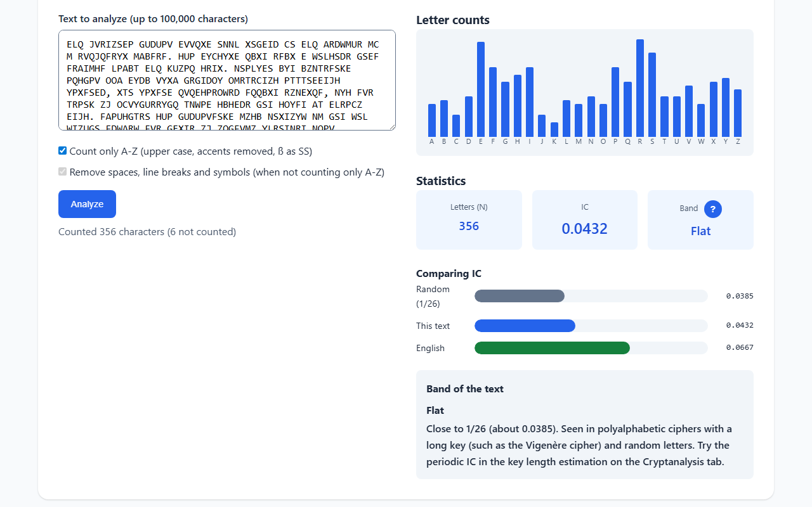
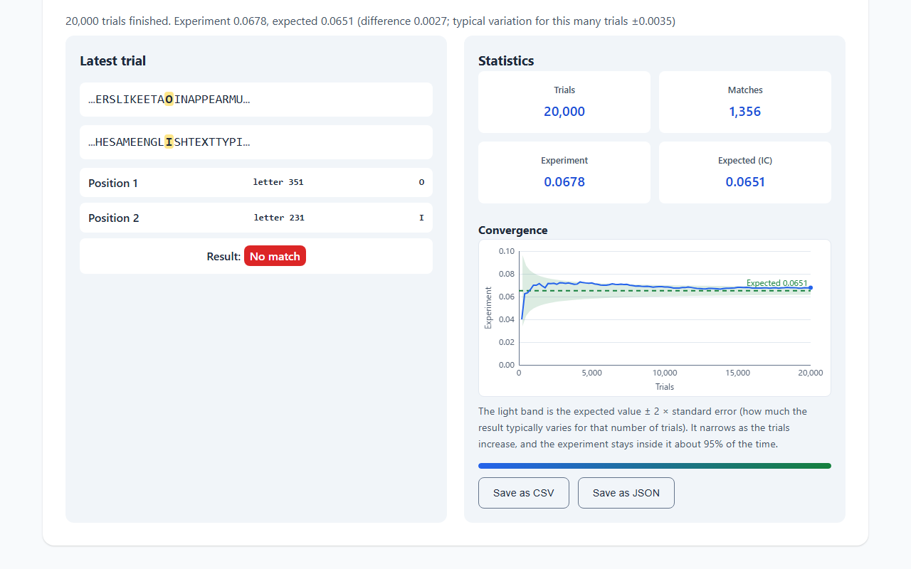
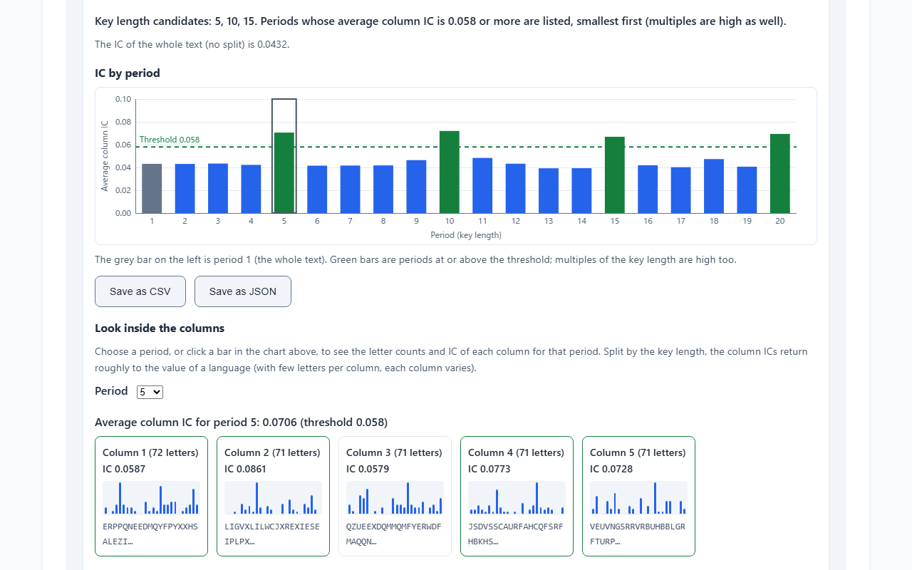
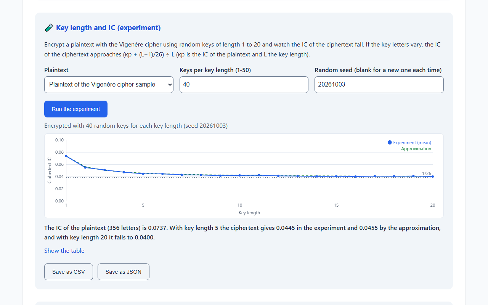
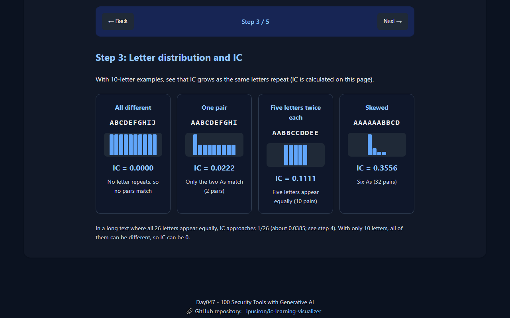
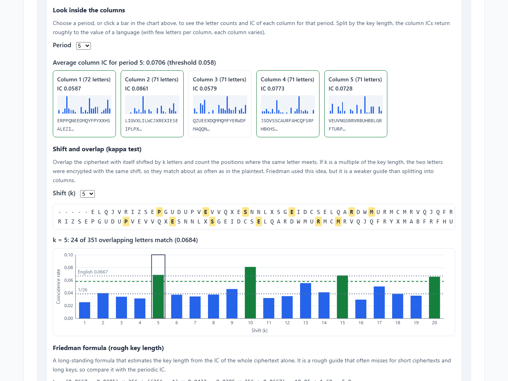
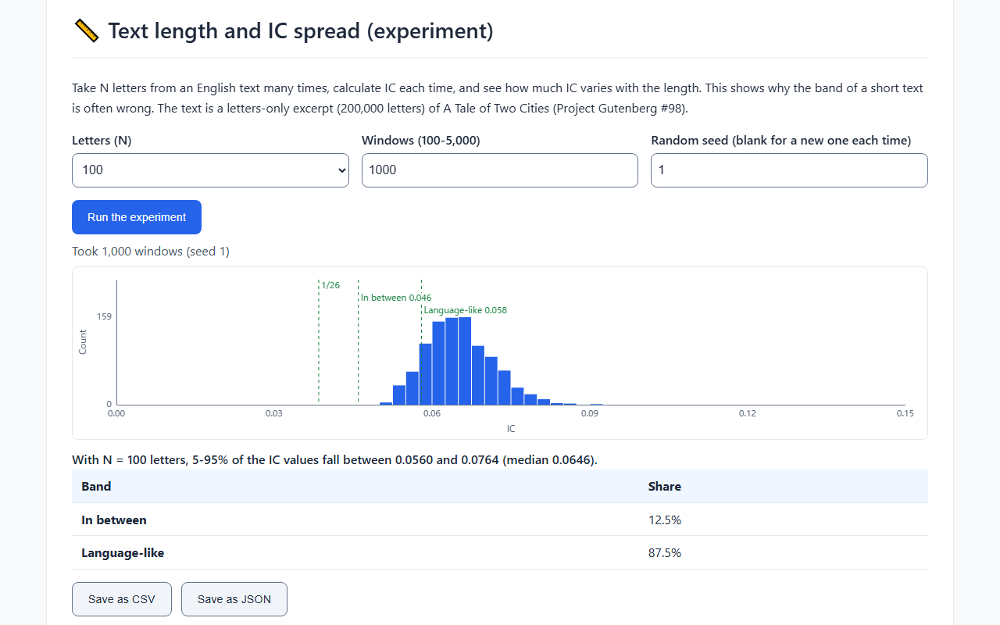

English · [日本語](README.md)

# IC Learning Visualizer - Visual Learning Tool for the Index of Coincidence


[](https://ipusiron.github.io/ic-learning-visualizer/)

**Day047 - 100 Security Tools with Generative AI**

The index of coincidence (IC) is the probability that two letters picked at random from a text (never the same position twice) are the same letter. It is useful in cryptanalysis, but its definition is hard for beginners to grasp. This educational tool helps you understand IC step by step through the calculation, sample comparison, Monte Carlo experiments, experiments that vary the text length and the cipher, and key length estimation by periodic IC and the kappa test. A random seed makes the experiments reproducible, and the results can be saved as CSV or JSON. The estimated key length can be passed to other tools together with the ciphertext. The input is handled only inside your browser and is never sent anywhere.

---

## 🌐 Demo

👉 **[https://ipusiron.github.io/ic-learning-visualizer/](https://ipusiron.github.io/ic-learning-visualizer/)**

You can try it directly in your browser.

---

## 📸 Screenshots

>
>
>*Analyzing the Vigenère cipher sample. IC is 0.0432 and the band is "Flat"*

>
>
>*Picking two letters from the English sample 20,000 times (random seed 20261004); the share of matches approaches the expected value (IC). The light band is the expected value ± 2 × standard error*

>
>
>*Bar chart of IC by period, and links that pass the ciphertext and key length to other tools*

>
>
>*IC of a plaintext encrypted with random keys of length 1 to 20 (random seed 20261003, 40 keys for each length; solid line) and the approximation (dashed line). The same values as the table under "Key length and IC experiment" below*

>
>
>*Step 7 of the step-by-step tab: the average column IC when a ciphertext with key length 5 is split with periods 1 to 12. It returns to the value of the language at 5 and 10 (dark mode)*

>
>
>*Inside key length estimation: letter counts and IC of the five columns for period 5, the matches when the ciphertext is shifted by 5 and overlapped (24 of 351), and the match rate for each shift*

>
>
>*Distribution of IC over 1,000 windows of 100 letters from an English text (random seed 1). 5-95% fall between 0.0560 and 0.0764, and 12.5% are "In between"*

---

## 📛 About the name

- IC: Index of Coincidence, a statistic used in classical cryptanalysis to estimate the key length and more
- Learning: shows that this is teaching material for education and learning, not just a calculator
- Visualizer: shows that you understand IC "by seeing", through histograms and Monte Carlo experiments, not only numbers and formulas

In short, "IC Learning Visualizer" means "a tool that visualizes the index of coincidence for learning and deeper understanding".

---

## ✨ Features

### 📚 Step-by-step tab

- What IC is (with HELLO, count the ways to pick two letters and the ways to get the same letter)
- The calculation: counts of the letters you enter, pairs n(n−1), numerator, denominator and IC
- Letter distribution and IC: the IC of four 10-letter examples, calculated on the page
- IC of languages and ciphertexts: random (1/26), English and the Vigenère cipher sample compared as bars
- Σp² and IC: the gap between the probability with the same position allowed (Σp²) and IC, for HELLO, ABABAB and the English sample
- Why a longer key lowers the IC: the approximation derived from the probability that two letters share a shift (about 1/L), with bars for each key length
- Why splitting by the period brings the IC back: bars of the average column IC of the Vigenère cipher sample for periods 1 to 12, and a button that moves to key length estimation on the Cryptanalysis tab
- An eight-question quiz to check your understanding (explanations, score, start over)

### 📊 Sample analysis tab

- Seven samples (English, random, Caesar cipher, Vigenère cipher, German, French, repetition) and your own text
- Bar chart of the A-Z counts, number of letters, IC and band (flat, in between, language-like, strongly skewed)
- When counting only A-Z, full-width letters become half-width and accents are removed (Ü → U, é → E, ß → SS)
- When not counting only A-Z, the counts and IC are calculated over every character that remains
- Text length and IC spread (experiment): take N letters (20 to 1,000) from the bundled English text 100 to 5,000 times and show a histogram of IC, the 5-95% range and the share of each band

### 🎲 Monte Carlo tab

- Repeat the trial of picking two letters from the text (never the same position twice) and watch the share of matches approach IC
- Texts: the text from the Sample analysis tab, the English, random and Vigenère cipher samples, and your own text
- Three speeds (one trial at a time, normal, results right away). Every speed draws about 100 points on the convergence chart
- The convergence chart shows a band of the expected value ± 2 × standard error (how much the result typically varies for that number of trials)
- With "Allow the same position twice (with replacement)", the experiment converges to Σ(n/N)² instead of IC
- The two positions picked in the latest trial are shown with the letters around them
- At the end, the difference between the experiment and the expected value is shown with the typical variation for that number of trials (2 × standard error)
- With a random seed, the same seed gives the same result. The convergence points can be saved as CSV or JSON

### 🔐 Cryptanalysis tab

- IC by language (values from two sources side by side)
- Types of cipher and IC (monoalphabetic, polyalphabetic, transposition)
- Key length and IC experiment: encrypt a plaintext with random keys of length 1 to 20 and plot the IC of the ciphertext against the approximation
- Types of cipher and IC (experiment): encrypt the same plaintext with substitution, columnar transposition, the Vigenère cipher (choose the key length) and the autokey cipher, and compare the IC, band and key length candidate
- Vigenère key length estimation (periodic IC) with its bar chart, and a button that loads the sample ciphertext
- Inside key length estimation: look inside the columns (click a bar to see the letter counts and IC of each column for that period), shift and overlap (kappa test; matching positions are highlighted, with bars of the match rate for each shift) and the Friedman formula (the values substituted, compared with the first candidate)
- Links that open the estimated key length and the ciphertext in Day030, Day046, Day017 and Day009
- Links to related tools (Day009, Day028, Day030, Day044, Day046)

### 🖥️ Screen

- Japanese and English (the initial language is taken from ?lang= in the URL, then the saved choice, then the browser language; switching keeps the input and results)
- Light and dark modes (following the OS setting, with a button to switch)
- Tabs that work with the keyboard (left and right arrows, Home, End); Esc closes the help
- No horizontal overflow even on a 320 px wide smartphone
- Random seeds for the experiments, and saving results as CSV or JSON (see "Random seeds and saving results")

---

## 📖 Usage

1. Open the public version ([https://ipusiron.github.io/ic-learning-visualizer/](https://ipusiron.github.io/ic-learning-visualizer/))
2. On the "Step by step" tab, go through the definition and calculation of IC
3. On the "Sample analysis" tab, compare the IC and band of the samples. You can analyze your own text as well
4. On the "Monte Carlo" tab, watch the experiment approach the expected value
5. On the "Cryptanalysis" tab, experiment with key length and IC and with types of cipher, and estimate the key length from a Vigenère ciphertext. The estimated key length can be passed to other tools through the links
6. To make every screen in a class or an article the same, enter the same number in the "Random seed" field of the experiments. The results can be saved as CSV or JSON

The buttons at the top right switch between Japanese and English and between light and dark. To run it locally, run `python -m http.server 8000` or similar in the folder and open `http://localhost:8000/`.

---

## 🔗 Passing text in the URL

Add `#text=` (or `?text=`) to the URL to open the tool with that text already analyzed on the Sample analysis tab and in the key length estimation. Use `&tab=` to choose the tab (`learn`, `analyze`, `monte` or `advanced`; the default is sample analysis). This is useful for opening the tool with a ciphertext from another tool or an article.

- `https://ipusiron.github.io/ic-learning-visualizer/#text=ELQJVRIZSEPGUDUPVEVVQXESNNLXSGEIDCSELQARDWMURMCMRVQJQFRYXMABFRF&tab=advanced` (the first sentence of the Vigenère cipher sample, 63 letters; the first key length candidate is 5)
- The part after `#` is not sent to the server, so the ciphertext does not reach GitHub Pages and is not subject to the URL length limit (GitHub Pages accepts up to 8,192 bytes for the path and the part after `?`). With `?text=`, more than about 8,150 characters ends on an error page
- The text takes up to 10,000 characters (the same limit as Day030 and Day046). If both `#` and `?` have it, `#` wins
- After reading it, the tool removes only `text` from both `#` and `?` in the URL (`tab` and `lang` stay), so the ciphertext does not remain in the address bar, bookmarks or copied URLs. The URL as opened may still remain in the browser history and in the GitHub Pages server logs
- Cipher Clairvoyance (Day044) can pass a ciphertext it judges to be a Vigenère or autokey cipher to the key length estimation tab in this form
- The language can be chosen with `?lang=ja` or `?lang=en`

---

## 🔬 What is the index of coincidence (IC)?

With n_i the count of each letter and N the total number of letters, IC is calculated as follows.

$$IC = \frac{\sum_i n_i (n_i - 1)}{N (N - 1)}$$

- The denominator N(N−1) is the number of ways to pick two letters in order. The numerator is the number of ways to pick a pair of the same letter in order
- In a long text where all 26 letters appear equally, IC approaches 1/26 (about 0.0385)
- In English text, E, T, A and others appear often, so IC is about 0.066
- Monoalphabetic substitution (the Caesar cipher and others) and transposition keep the set of letter counts of the plaintext, so their IC is the same as the plaintext
- Polyalphabetic substitution (the Vigenère cipher and others) approaches 1/26 as the key gets longer

The mathematical details are in [about_ic.en.md](about_ic.en.md) (Japanese version: [about_ic.md](about_ic.md)).

---

## 📊 Bands and samples

On the Sample analysis tab, IC is put into one of four bands. Texts under 50 letters are not classified, and texts under 200 letters get a note that the band can be wrong.

| Band | IC range | Seen in |
|---|---|---|
| Flat | below 0.046 | Polyalphabetic ciphers with a long key, random letters |
| In between | 0.046-0.058 | Polyalphabetic ciphers with a short key (2 or 3 letters), text mixing plaintext and ciphertext |
| Language-like | 0.058-0.10 | Plaintext, monoalphabetic substitution, transposition |
| Strongly skewed | 0.10 or more | Artificial text such as the same letters repeated |

The values of the samples (counting only A-Z) are as follows.

| Sample | Letters | IC | Band |
|---|---|---|---|
| English text | 475 | 0.0651 | Language-like |
| Random | 300 | 0.0388 | Flat |
| Caesar cipher | 334 | 0.0691 | Language-like |
| Vigenère cipher | 356 | 0.0432 | Flat |
| German | 449 | 0.0768 | Language-like |
| French | 434 | 0.0842 | Language-like |
| Repetition | 300 | 0.1973 | Strongly skewed |

- The random sample is 300 uniform letters made with a random generator with a fixed seed (always the same string)
- The Caesar cipher sample is English text shifted by 3 letters, and the Vigenère cipher sample is English text encrypted with the key LEMON
- German and French are counted with their accents removed

---

## 📏 Text length and IC spread

The experiment on the Sample analysis tab shows why the band of a short text is often wrong. It takes N letters at random positions from the bundled English text again and again, calculates IC each time, and shows the distribution and the share of each band. With random seed 1 and 1,000 windows, the results are as follows.

| Letters | 5% | Median | 95% | Language-like | In between |
|---|---|---|---|---|---|
| 20 | 0.0368 | 0.0579 | 0.0947 | — | — |
| 50 | 0.0498 | 0.0629 | 0.0800 | 72.1% | 25.8% |
| 100 | 0.0560 | 0.0646 | 0.0764 | 87.5% | 12.5% |
| 200 | 0.0593 | 0.0653 | 0.0737 | 97.3% | 2.7% |
| 500 | 0.0619 | 0.0659 | 0.0710 | 100.0% | 0.0% |
| 1000 | 0.0624 | 0.0660 | 0.0698 | 100.0% | 0.0% |

- 20 letters is under 50, so no band is given (the 5-95% range is as wide as 0.037 to 0.095)
- With 50 letters, a quarter fall into "In between". This is why texts under 50 letters are not classified and texts under 200 letters get a note that the band can be wrong
- The English text is 200,000 letters taken from Charles Dickens, A Tale of Two Cities (Project Gutenberg #98, public domain in the United States), letters only. The source and SHA-256 are in `corpus/NOTICE.md`
- The windows come from a single novel, so other texts and languages spread differently

---

## 🧪 Key length and IC experiment

The Vigenère cipher encrypts each letter with a different shift depending on the key letter, so the longer the key, the flatter the letter counts of the ciphertext and the closer IC gets to 1/26. If the key letters vary, the IC of the ciphertext is close to the following approximation (κp is the IC of the plaintext, κr is 1/26 and L is the key length).

$$IC \approx \frac{\kappa_p + (L - 1)\,\kappa_r}{L}$$

On the Cryptanalysis tab, a plaintext is encrypted with random keys of length 1 to 20 (1 to 50 keys for each length), and the mean IC of the ciphertexts is plotted against the approximation. With the plaintext of the Vigenère cipher sample (356 letters, IC 0.0737) and 40 keys for each length from a random generator with a fixed seed (20261003), the results are as follows.

| Key length | Approximation | Experiment (mean of 40 keys) |
|---|---|---|
| 1 | 0.0737 | 0.0737 |
| 2 | 0.0561 | 0.0547 |
| 3 | 0.0502 | 0.0508 |
| 5 | 0.0455 | 0.0445 |
| 10 | 0.0420 | 0.0419 |
| 20 | 0.0402 | 0.0400 |

- Key length 1 is a monoalphabetic cipher (a single shift), so the value is that of the plaintext
- With the seed left blank, the experiment uses new random keys each time, so the values change slightly from run to run. With seed 20261003 and 40 keys, it gives the same values as this table

---

## 🧪 Types of cipher and IC

The experiment on the Cryptanalysis tab encrypts the same plaintext with five methods and compares the IC, band and key length candidate from periodic IC. With the plaintext of the Vigenère cipher sample (356 letters), random seed 20261004 and a Vigenère key length of 5, the results are as follows.

| Method | IC | Band | Key length candidate |
|---|---|---|---|
| Plaintext | 0.0737 | Language-like | 1 (high without splitting) |
| Substitution (random alphabet) | 0.0737 | Language-like | 1 (high without splitting) |
| Columnar transposition (width 7) | 0.0737 | Language-like | 1 (high without splitting) |
| Vigenère cipher (key length 5) | 0.0419 | Flat | 5 |
| Autokey cipher (5-letter primer) | 0.0400 | Flat | none |

- Substitution and columnar transposition keep the set of letter counts of the plaintext, so their IC is exactly that of the plaintext. IC alone cannot tell these two from the plaintext
- When the whole text has an IC of 0.058 or more, it already has the value of a language without splitting, so the key length candidate is 1
- The autokey cipher continues its key with the plaintext itself, so it has no period, and periodic IC cannot find a key length

---

## 🔑 How key length estimation works

The ciphertext is split into columns with period L (letters 1, L+1, 2L+1, … form column 1), and the IC of each column is averaged. If the period is the key length, each column is a Caesar cipher with a single shift, so the IC returns to the value of the language. Multiples of the key length are high as well, and shorter columns make the values noisier, so simply sorting by IC tends to put a multiple first. Therefore, periods whose average column IC is 0.058 or more come first, smallest first, followed by the rest by average. Periods are checked as long as every column has at least 3 letters (up to 20).

For the Vigenère cipher sample (key LEMON), the results are as follows.

| Period | Average column IC |
|---|---|
| 2 | 0.0431 |
| 3 | 0.0434 |
| 5 | 0.0706 |
| 10 | 0.0720 |
| 15 | 0.0669 |
| 20 | 0.0694 |

- The periods at 0.058 or more are 5, 10, 15 and 20, and the first candidate is 5 (the length of the key LEMON)
- Simply sorting by IC would put period 10 (0.0720) above period 5 (0.0706)
- The IC of the whole text (no split) is 0.0432. When the whole text has an IC of 0.058 or more, the page notes that it may be plaintext, a monoalphabetic cipher or a transposition cipher
- Below the results, a bar chart of IC by period (green at or above the threshold) and links that pass the ciphertext are shown. Modular Text Divider (Day030) and AlphaLoom (Day046) also receive the first key length candidate (both up to 10,000 letters). Vigenère Cipher Tool (Day017) and Frequency Analyzer (Day009, up to 5,000 letters) receive only the ciphertext. When the text cannot be passed, only the page opens

---

## 🔍 Inside key length estimation (columns, kappa test, Friedman formula)

Below the key length results, three methods show why the estimation works.

- Look inside the columns: choose a period, or click a bar of IC by period, to see the letter counts and IC of each column for that period. Split with period 5, the sample gives column ICs of 0.0587, 0.0861, 0.0579, 0.0773 and 0.0728 (average 0.0706). Each column has only 71 or 72 letters, so the columns vary
- Shift and overlap (kappa test): overlap the ciphertext with itself shifted by k letters and count how often the same letter meets. If k is a multiple of the key length, the two letters were encrypted with the same shift, so they match about as often as in the plaintext. For the sample, the rate is 0.0684 at k = 5, 0.0809 at k = 10 and 0.0340 at k = 3
- Friedman formula: a rough key length from the IC of the whole ciphertext alone (κp is 0.0667 for English, κr is 1/26 and N is the number of letters)

$$L \approx \frac{(\kappa_p - \kappa_r)\,N}{(N - 1)\,IC - \kappa_r N + \kappa_p}$$

For the sample (356 letters, IC 0.0432), it gives about 5.93, which rounds to 6, not the key length 5. During development, N letters taken from the bundled English text were encrypted with random keys of length 3 to 10 (100 each), and the three methods were compared by how often the correct key length came first.

| Letters | Periodic IC | Kappa test | Friedman formula (rounded) | Friedman formula (within ±1) |
|---|---|---|---|---|
| 100 | 64% | 23% | 9% | 18% |
| 200 | 87% | 34% | 14% | 25% |
| 400 | 98% | 56% | 18% | 35% |
| 1000 | 98% | 76% | 21% | 38% |

- Periodic IC is the first candidate of the tool. The kappa test takes the smallest shift whose match rate is 0.058 or more
- The kappa test and the Friedman formula are shown for learning the ideas Friedman used; the key length candidates come from periodic IC

---

## 🎲 How the Monte Carlo experiment works

- Each trial picks two positions uniformly so that they are never the same (as in the definition of IC). The expected share of matches equals IC
- With "Allow the same position twice (with replacement)", picking the same position twice (always a match) is counted too, so the expected value becomes Σ(n/N)². For the English sample, IC is 0.0651 and Σ(n/N)² is 0.0671
- The typical variation of the share after n trials is 2 × the standard error √(p × (1 − p) / n), where p is the expected value. For the English sample (IC 0.0651), it is about ±0.016 after 1,000 trials and about ±0.0035 after 20,000 trials. The band on the convergence chart is this range, and the experiment stays inside it about 95% of the time
- Random numbers come from Math.random when the seed is blank, and from xorshift32 when a seed is given (this is a learning experiment, not a cryptographic use)
- The calculations run on the main thread in small chunks. On this machine with Node.js 22, IC of 100,000 letters took about 0.4 ms, the column IC up to period 20 about 8 ms, and 100,000 trials about 3 ms

---

## 💾 Random seeds and saving results

- The Monte Carlo experiment, text length and IC spread, the key length and IC experiment, and types of cipher and IC have a random seed field. Enter an integer from 0 to 4294967295 and the same seed gives the same result. Leave it blank for new random numbers each time
- When an experiment finishes, the status line shows the seed it used ("seed 20261003" and so on). Use it to make every screen in a class the same or to reproduce the figures in an article
- The results can be saved as CSV or JSON (the Monte Carlo convergence points, the spread values, the key length and IC experiment, the cipher comparison, and IC by period with the kappa test and Friedman formula)
- The file name is `ic-learning-visualizer_<kind>_YYYYMMDD-HHMM.csv` (`.json` for JSON)
- CSV files are UTF-8 (with BOM) with CRLF line endings, and every cell is enclosed in `"`. They open as they are in spreadsheet software
- The files are only created and saved inside the browser and are never sent anywhere

---

## 📊 IC by language

The values depend on the texts counted, so they differ a little from source to source. The Cryptanalysis tab shows the values from the following two sources.

| Language | Friedman & Callimahos (normalized → IC) | dCode |
|---|---|---|
| English | 1.73 → 0.0665 | 0.0667 |
| French | 2.02 → 0.0777 | 0.0778 |
| German | 2.05 → 0.0788 | 0.0762 |
| Italian | 1.94 → 0.0746 | 0.0738 |
| Spanish | 1.94 → 0.0746 | 0.0770 |
| Portuguese | 1.94 → 0.0746 | — |

- The normalized value is IC × 26 (1.00 when all 26 letters appear equally)
- Sources: W. F. Friedman and L. D. Callimahos, Military Cryptanalytics, Part I (the table in [Wikipedia "Index of coincidence"](https://en.wikipedia.org/wiki/Index_of_coincidence)) and [dCode "Index of Coincidence"](https://www.dcode.fr/index-coincidence)

---

## 🎯 Use cases

- Cryptography classes: put the plaintext, Caesar cipher and Vigenère cipher samples side by side and show with numbers that IC does not change under monoalphabetic substitution and approaches 1/26 under polyalphabetic substitution. The key length experiment shows on a graph that IC falls as the key gets longer and matches the approximation well. The cipher comparison shows that substitution and columnar transposition keep exactly the IC of the plaintext, so IC alone cannot tell them apart
- Probability and statistics classes: check "the probability that two picked letters match" with the Monte Carlo experiment, and experience that the experiment approaches the expected value as the trials increase (the law of large numbers) and that the band (standard error) narrows. You can also compare the expected values with and without replacement. The text length and IC spread experiment shows on a histogram that the smaller the sample, the wider the spread of the estimate
- Classical crypto problems in CTFs: use IC to judge whether a ciphertext is monoalphabetic or polyalphabetic, estimate the key length by periodic IC, and check how each column is skewed by looking inside the columns. Some ciphers, such as the autokey cipher, show no period. Once you have a candidate, follow the links to split the text into columns in [Modular Text Divider (Day030)](https://ipusiron.github.io/modular-text-divider/) or search for a key that is an English word in [AlphaLoom (Day046)](https://ipusiron.github.io/alphaloom/)
- Making puzzles and cipher games: check the IC of a ciphertext you made to see whether it could be broken by frequency analysis (whether it looks like language). The experiment also shows how far IC falls when you change the key length
- Comparing languages: confirm with the German and French samples or your own texts that IC differs between languages (including how much short texts vary)
- Measuring how skewed letters are: compare how skewed the letters of a text are (how many repeated letters) with a single number. Artificial text with many repetitions has a large IC
- English classes and learners abroad: switch the screen to English and run the same experiments with English explanations
- Self-study: go through the definition and calculation, why a longer key lowers the IC and why splitting by the period brings it back on the step-by-step tab, and check your understanding with the eight-question quiz
- Figures for articles and teaching material: fix a random seed to reproduce the same figure, or save the results as CSV and make other graphs in spreadsheet software

---

## 🔒 Security and privacy

- The text you enter is handled only inside the browser. Nothing is sent to or stored on a server
- The links to other tools put the ciphertext (and key length) after `#` in the URL only when clicked (so it is not sent to the server), and open it in a new tab (`rel="noopener noreferrer"`)
- `text` received in the URL is removed from the address bar after reading (the URL as opened may remain in the browser history, and in server logs when it came with `?text=`)
- A Content Security Policy (meta) limits scripts, styles and connections to the same site. No inline scripts, inline event handlers or style attributes are used
- Every letter and result is put on the screen with `textContent` (never interpreted as HTML)
- Input up to 100,000 characters, and `#text=` or `?text=` in the URL up to 10,000 characters
- Only the theme and language choices are saved in localStorage (the tool works where storage is unavailable)
- Saving results only creates a file inside the browser and downloads it (nothing is sent)
- The English text for the spread experiment (`corpus/eval-pg98.txt`) is loaded from the same site

---

## ⚠️ Notes and limitations

- IC depends only on the letter counts. The band is a guide for guessing the type of cipher, not a way to identify it
- In short texts, even plaintext varies a lot. Texts under 50 letters are not classified, and under 200 letters the band can be wrong
- Monoalphabetic substitution and transposition both keep the IC of the plaintext, so IC alone cannot tell them apart (look at letter frequencies and n-grams)
- Key length estimation covers periods where every column has at least 3 letters (up to 20) and ciphertexts of at least 20 letters. Longer keys and shorter ciphertexts make it miss more often
- The approximation in the key length experiment is a guide for keys whose letters vary. With keys of repeated letters (such as AAA), the IC of the ciphertext does not fall
- The IC values by language come from sources and depend on the texts counted
- The kappa test and the Friedman formula are shown for learning. Key length candidates come from periodic IC (the kappa test is right 34% of the time at 200 letters, and the Friedman formula only 21% even at 1,000 letters when rounded)
- For ciphers without a period, such as the autokey cipher, periodic IC cannot find a key length either
- The text length and IC spread experiment takes windows from a single English text. Other texts and languages spread differently
- The random seed is for reproducing learning experiments (xorshift32) and must not be used to generate cryptographic keys
- If the page is opened directly as a file (file://), the tool does not start in Chrome or Edge (they cannot load ES modules from files). A notice appears on the screen; open it over HTTP as described under "Usage" above

---

## 🧪 Tests

The logic (`js/ic-core.js`, `js/ciphers.js`, `js/export.js`, `js/samples.js`, `js/links.js`, `js/params.js`) is kept in modules that do not depend on the DOM and is tested with the standard Node.js test runner (`node:test`). There are no dependencies.

```bash
npm test
```

- Node.js 22 or later
- Runs automatically in GitHub Actions on every push and pull request
- Checks known IC answers (HELLO = 0.1000 and others), normalization, periodic IC, key length candidates, bands, the convergence of the Monte Carlo experiment (within 4 standard errors) and a known Vigenère answer (ATTACKATDAWN with the key LEMON gives LXFOPVEFRNHR)
- Also checks that the key length experiment matches the approximation within 0.004, the links to other tools and the URL parameters, and that the Japanese and English dictionaries have the same keys with no Japanese in English
- Checks the properties of the samples (the Vigenère cipher sample is not undone by a single shift, the random sample has an IC near 1/26) and the tables and numbers in the Japanese and English READMEs
- Also checks the CSP, labels and tab roles in index.html, and color contrast (at least 4.5:1 in both light and dark modes)
- Checks the kappa test, columns, Friedman formula, text length spread (SHA-256 of the bundled English text), the cipher comparison (a known autokey answer: ATTACKATDAWN with the primer QUEENLY gives QNXEPVYTWTWP), random seeds, CSV and JSON
- Also reproduces the values in steps 5 to 7, the reasons for the eight quiz answers, and the measured values written in about_ic and the READMEs (spread, cipher types, key length accuracy)

---

## 📁 Directory structure

```
ic-learning-visualizer/
├── .github/                # GitHub settings
│   └── workflows/          # GitHub Actions workflows
│       └── test.yml        # Runs npm test on push and pull requests
├── assets/                 # Images
│   ├── en/                 # Screenshots for the English README
│   │   ├── screenshot.png  # Sample analysis
│   │   ├── screenshot2.png # Monte Carlo experiment
│   │   ├── screenshot3.png # Key length estimation
│   │   ├── screenshot4.png # Key length and IC experiment
│   │   ├── screenshot5.png # Step 7 of step by step, dark
│   │   ├── screenshot6.png # Columns and the kappa test
│   │   └── screenshot7.png # Text length and IC spread
│   ├── favicon.svg         # Favicon
│   ├── screenshot.png      # Screenshot for the Japanese README (sample analysis)
│   ├── screenshot2.png     # Screenshot for the Japanese README (Monte Carlo)
│   ├── screenshot3.png     # Screenshot for the Japanese README (key length estimation)
│   ├── screenshot4.png     # Screenshot for the Japanese README (key length and IC)
│   ├── screenshot5.png     # Screenshot for the Japanese README (step 7, dark)
│   ├── screenshot6.png     # Screenshot for the Japanese README (columns and kappa test)
│   └── screenshot7.png     # Screenshot for the Japanese README (text length and IC spread)
├── corpus/                 # English text for the spread experiment
│   ├── NOTICE.md           # Source and SHA-256 of the English text
│   └── eval-pg98.txt       # Letters-only excerpt of A Tale of Two Cities (#98)
├── js/                     # Modules other than the screen
│   ├── chart.js            # Charts (convergence, IC by period, kappa, key length and IC, spread)
│   ├── ciphers.js          # Classical ciphers for the cipher comparison (substitution, columnar, autokey)
│   ├── export.js           # Exporting results (CSV, JSON)
│   ├── file-check.js       # Notice when the tool cannot start from file://
│   ├── i18n.js             # Choosing and switching the language (Japanese, English)
│   ├── ic-core.js          # IC logic (normalization, periodic IC, key length, bands, Monte Carlo, experiments, kappa, columns, Friedman, seeds)
│   ├── links.js            # Links that pass the ciphertext to other tools
│   ├── messages.js         # Strings shown on the screen (Japanese, English)
│   ├── params.js           # Reads #text= and tab= (or ?) from the URL
│   ├── samples.js          # Samples, step examples, quiz answers and the language IC table
│   ├── tabs.js             # Tab switching (including the keyboard)
│   ├── theme-init.js       # Applies the theme at the start of loading
│   └── theme.js            # Light/dark switching
├── test/                   # Tests (node:test)
│   ├── analysis.test.js    # Kappa test, columns, Friedman formula, seeds, export
│   ├── ciphers.test.js     # Substitution, columnar, autokey and the cipher comparison
│   ├── contrast.test.js    # Color contrast, sizes of fields and controls
│   ├── core.test.js        # IC, normalization, key length, bands, Monte Carlo, known answers
│   ├── experiment.test.js  # Key length experiment, approximation, variation band
│   ├── format.test.js      # Line length, control characters, minimum line counts
│   ├── html.test.js        # CSP, element ids, tab roles, labels
│   ├── i18n.test.js        # Keys of both languages, no Japanese in English, initial language
│   ├── links.test.js       # Links to other tools, URL parameters
│   ├── messages.test.js    # Where strings live and their keys
│   ├── readme.test.js      # Tables, structure, tree and images of both READMEs
│   ├── samples.test.js     # Properties of the samples, step examples, quiz answer
│   ├── spread.test.js      # Bundled English text and the length spread
│   └── steps.test.js       # Values in steps 5 to 8 and the reasons for the eight quiz answers
├── .gitignore              # Git ignore settings
├── .nojekyll               # Tells GitHub Pages not to use Jekyll
├── CLAUDE.md               # Development notes for Claude Code
├── LICENSE                 # License (MIT)
├── README.en.md            # This document
├── README.md               # Japanese document
├── about_ic.en.md          # Mathematical details of IC (English)
├── about_ic.md             # Mathematical details of IC (Japanese)
├── index.html              # Screen
├── package.json            # npm test settings (no dependencies)
├── script.js               # Screen logic (ES module)
└── style.css               # Styles (light and dark)
```

---

## 💻 Requirements

- Tested with the latest Chrome, Edge and Firefox (Safari has not been tested)
- The public version ([https://ipusiron.github.io/ic-learning-visualizer/](https://ipusiron.github.io/ic-learning-visualizer/)) can be used as it is
- To run it locally, run `python -m http.server 8000` or similar in the folder and open `http://localhost:8000/`

---

## 📄 License

- See the `LICENSE` file for the license of the source code.

---

## 🛠️ About this tool

This tool was developed as part of the "100 Security Tools with Generative AI" project.
The project creates and publishes a wide variety of security-related tools over 100 days with the help of AI.

For details about the project and other tools, see the following page.

🔗 [https://akademeia.info/?page_id=42163](https://akademeia.info/?page_id=42163)
