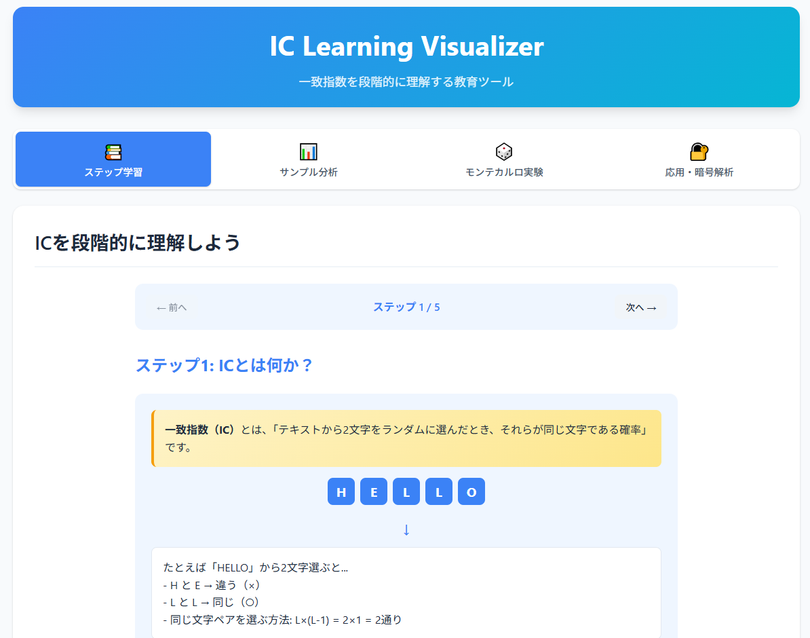

<!--
---
title: IC Learning Visualizer
category: classic-crypto
difficulty: 1
description: An educational tool to intuitively understand the Index of Coincidence (IC) through histograms and probability experiments.
tags: [cryptography, classic, statistics, visualization, education]
demo: https://ipusiron.github.io/ic-learning-visualizer/
---
-->

# IC Learning Visualizer - 一致指数をビジュアル理解するツール


[](https://ipusiron.github.io/ic-learning-visualizer/)

**Day047 - 生成AIで作るセキュリティツール100**

**一致指数（Index of Coincidence：IC）** とは、あるテキストからランダムに2文字を選んだとき、それらが同じ文字である確率を表す統計量です。

ICの概念は暗号解読に役立ちます。
しかしながら、定義は初学者にとってわかりにくいといえます。

本ツールは、**頻度ヒストグラム** と **確率実験** を用いることでICを直感的に理解することをゴールとした教育ツールです。

---

## 📛 ツール名の由来・意味
- **IC**: Index of Coincidence（一致指数）。古典暗号解読で鍵長推定などに使われる統計量。
- **Learning**: 単なる計算器ではなく、教育・学習目的で **IC の直感的理解を助ける教材** であることを示す。
- **Visualizer**: 数値や式だけでなく、**ヒストグラムやモンテカルロ実験を通じて「見て理解できる」** ツールであることを表現。  

つまり「IC Learning Visualizer」とは、**「一致指数を学習用に可視化し、理解を深めるためのツール」** を意味します。  

---

## 🌐 デモページ

👉 **[https://ipusiron.github.io/ic-learning-visualizer/](https://ipusiron.github.io/ic-learning-visualizer/)**

ブラウザーで直接お試しいただけます。

---

## 📸 スクリーンショット

>   
>
> *ICのステップアップ理解を支援する*

---

## ✨ 機能

### 📚 ステップ学習タブ
- ICの基本概念から段階的に学習
- 数式の各項目を詳しく解説（n(n-1)の意味など）
- 文字分布パターンとICの関係を可視化
- 理解度チェッククイズ

### 📊 サンプル分析タブ
- 複数言語のサンプル文章（英語、ドイツ語、フランス語など）
- 暗号文サンプル（シーザー暗号、ヴィジュネル暗号）
- A-Z頻度ヒストグラム表示
- テキストタイプ自動推定機能

### 🎲 モンテカルロ実験タブ
- **「ランダムに2文字を選ぶ→一致確率」** を実験的に計算
- 理論値との収束過程を可視化
- カスタムテキスト入力対応
- リアルタイム収束グラフ

### 🔐 応用・暗号解析タブ
- 言語判定（各言語のIC値範囲）
- 暗号タイプ判別（単一換字、多表式など）
- ヴィジュネル暗号の鍵長推定（フリードマンテスト）
- 関連ツールへのリンク集

---

## 🚀 使い方

### 初心者向け
1. `index.html` をブラウザーで開く
2. **「ステップ学習」タブ** でICの基本概念を段階的に学習
3. **「サンプル分析」タブ** でさまざまなテキストのIC値を比較
4. **「モンテカルロ実験」タブ** で確率実験を体験

### 上級者向け
1. **「サンプル分析」タブ** でカスタムテキストを分析
2. **「応用・暗号解析」タブ** でヴィジュネル暗号の鍵長推定
3. 関連ツールリンクから更なる暗号解析を実践  

---

## 📖 一致指数（IC）とは

**一致指数（Index of Coincidence; IC）** とは、あるテキストからランダムに2文字を選んだとき、それらが同じ文字である確率を表す統計量です。

文字ごとの出現回数を \( n_i \)、総文字数を \( N \) とすると、次式で定義されます。

\[
IC = \frac{\sum_i n_i (n_i - 1)}{N (N - 1)}
\]

- **等分布の英字ランダム文字列**では、ICがおよそ **1/26 ≈ 0.0385**。  
- **実際の英語平文**では文字の偏り（'E'が多いなど）があるため、ICが **0.066–0.068** 程度になります。
- この差を利用して、ヴィジュネル暗号などの **鍵長推定や暗号文解析**に応用されます。

### 一致指数についての詳細解説

👉 **[ICの数学的詳細](about_ic.md)**

---

## 📁 ディレクトリー構造

```
ic-learning-visualizer/
├── index.html          # メインのHTMLファイル（教育版タブ型UI）
├── script.js           # JavaScript機能（全タブ対応）
├── style.css           # スタイルシート（ライトテーマ）
├── test-xss.html       # XSS脆弱性テストファイル
├── about_ic.md         # ICの数学的詳細解説
├── CLAUDE.md           # Claude Code用プロジェクト文書
├── README.md           # このファイル
├── LICENSE             # MITライセンス
└── assets/
    └── screenshot.png  # ツールのスクリーンショット
```

---

## 📄 ライセンス

MIT License - 詳細は [LICENSE](LICENSE) をご覧ください。

---

## 🛠 このツールについて

本ツールは、「生成AIで作るセキュリティツール100」プロジェクトの一環として開発されました。  
このプロジェクトでは、AIの支援を活用しながら、セキュリティに関連するさまざまなツールを  
100日間にわたり制作・公開していく取り組みを行っています。

プロジェクトの詳細や他のツールについては、以下のページをご覧ください。

🔗 [https://akademeia.info/?page_id=42163](https://akademeia.info/?page_id=42163)
