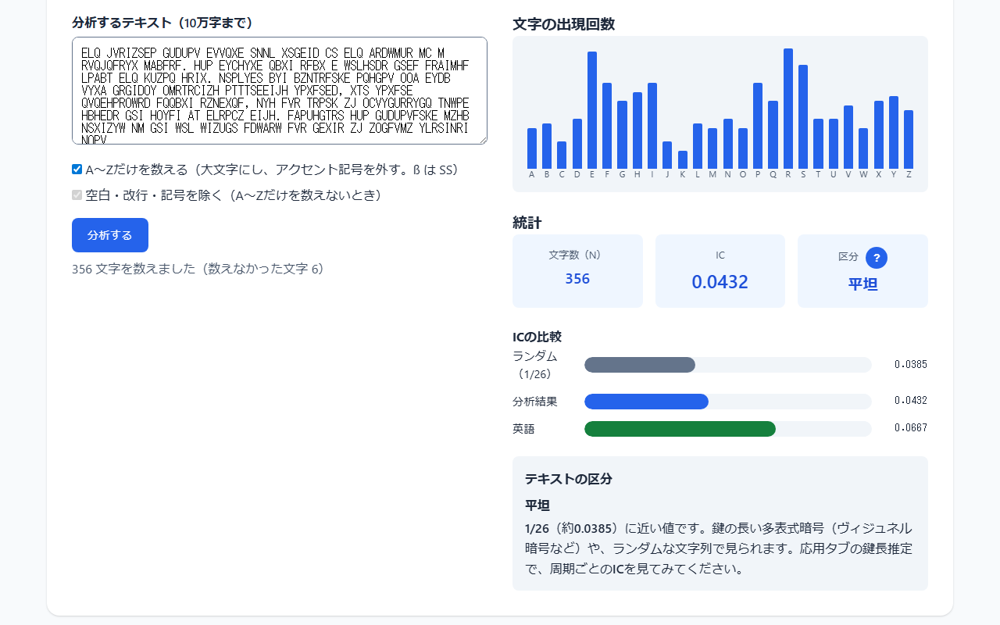
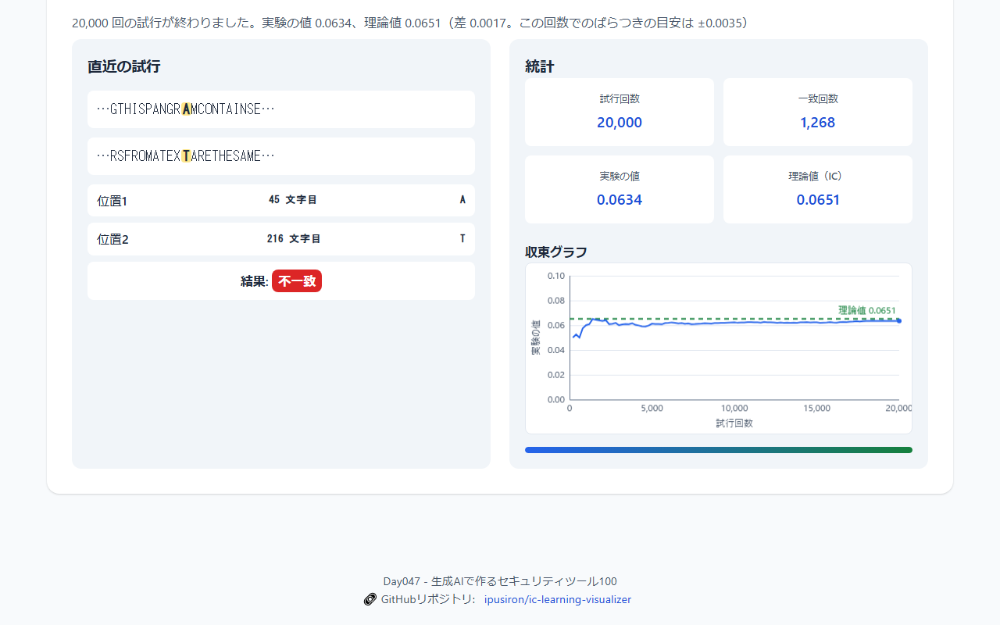
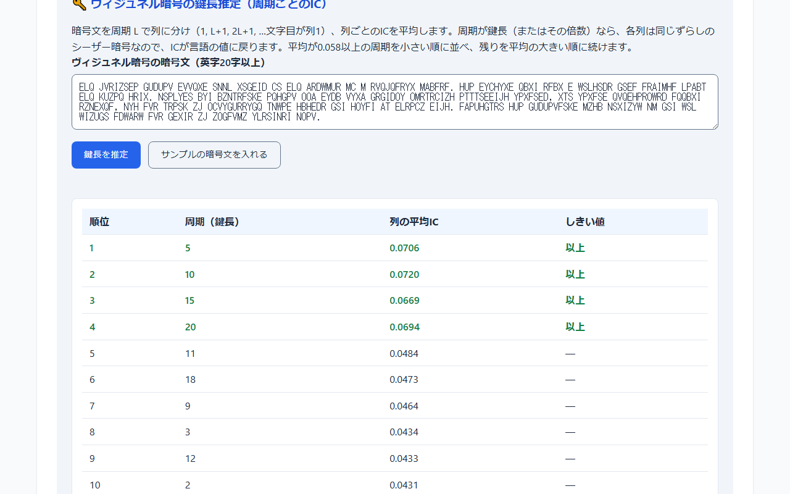
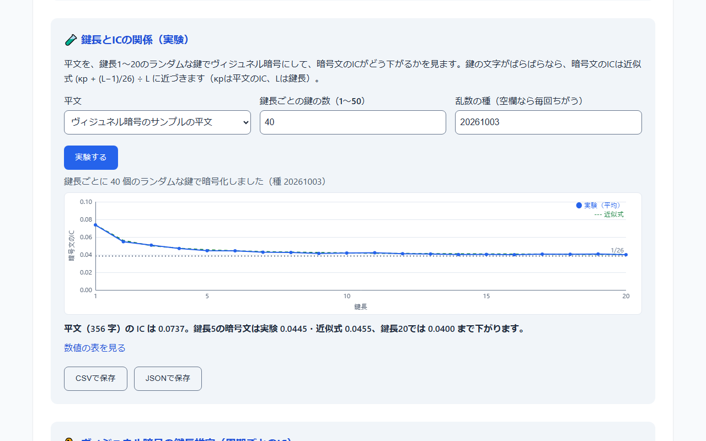
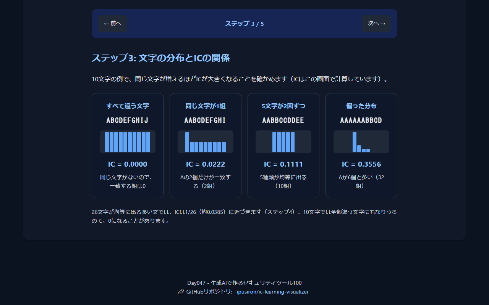
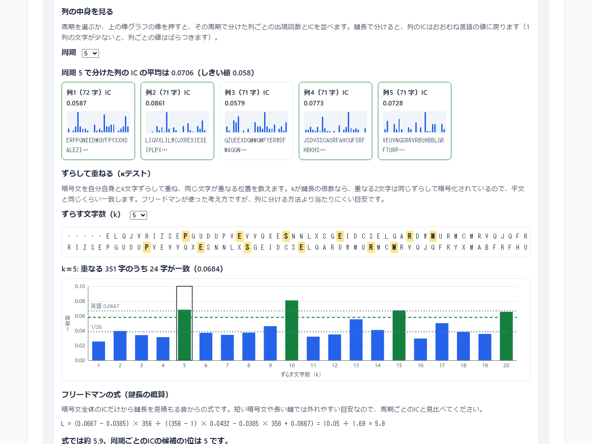
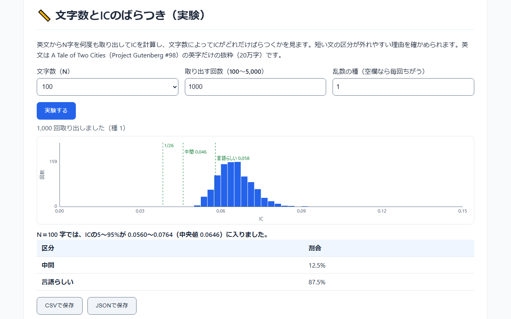

<!--
---
id: day047
slug: ic-learning-visualizer

title: "IC Learning Visualizer"

subtitle_ja: "一致指数をビジュアル理解するツール"
subtitle_en: "Visual learning tool for Index of Coincidence"

description_ja: "一致指数（IC）を、計算の内訳・サンプルの比較・モンテカルロ実験・文字数や暗号の種類を変える実験・周期ごとのICとκテストによる鍵長推定で段階的に理解するための教育ツール"
description_en: "An educational tool to understand the Index of Coincidence (IC) step by step through the calculation, sample comparison, Monte Carlo experiments, experiments that vary the text length and the cipher, and key length estimation by periodic IC and the kappa test"

category_ja:
  - 古典暗号
  - 暗号解析
category_en:
  - Classical Cryptography
  - Cryptanalysis

difficulty: 3

tags:
  - cryptography
  - index-of-coincidence
  - vigenere
  - friedman-test
  - monte-carlo
  - visualization
  - statistics
  - education

repo_url: "https://github.com/ipusiron/ic-learning-visualizer"
demo_url: "https://ipusiron.github.io/ic-learning-visualizer/"

hub: true
---
-->

[English](README.en.md) · 日本語

# IC Learning Visualizer - 一致指数をビジュアル理解するツール


[](https://ipusiron.github.io/ic-learning-visualizer/)

**Day047 - 生成AIで作るセキュリティツール100**

一致指数（Index of Coincidence：IC）は、テキストから2文字を（同じ位置を選ばずに）ランダムに選んだとき、それらが同じ文字である確率です。暗号解読に役立つ一方で、定義は初学者にはわかりにくいといえます。本ツールは、計算の内訳、サンプルの比較、モンテカルロ実験、文字数や暗号の種類を変える実験、周期ごとのICとκテストによる鍵長推定を通じて、ICを段階的に理解するための教育ツールです。乱数の種を入れると実験の結果を再現でき、結果はCSV・JSONで保存できます。推定した鍵長は、暗号文といっしょにほかのツールへ渡せます。入力はブラウザーの中だけで扱い、外部へは送りません。

---

## 🌐 デモページ

👉 **[https://ipusiron.github.io/ic-learning-visualizer/](https://ipusiron.github.io/ic-learning-visualizer/)**

ブラウザーで直接お試しいただけます。

---

## 📸 スクリーンショット

>
>
>*ヴィジュネル暗号のサンプルを分析したところ。ICは0.0432で、区分は「平坦」*

>
>
>*英語のサンプルから2文字を20,000回選び（乱数の種20261004）、一致した割合が理論値（IC）に近づく様子。薄い帯は理論値±2×標準誤差*

>
>
>*周期ごとのICの棒グラフと、暗号文と鍵長をほかのツールへ渡すリンク*

>
>
>*平文を鍵長1〜20のランダムな鍵（乱数の種20261003、鍵長ごとに40個）で暗号化したときのIC（実線）と近似式（破線）。下の「鍵長とICの実験」の表と同じ値*

>
>
>*ステップ学習の7: 鍵長5の暗号文を周期1〜12で分けたときの列のICの平均。5と10で言語の値に戻る（ダークモード）*

>
>
>*鍵長推定の中身。周期5で分けた5つの列の出現回数とIC、暗号文を5文字ずらして重ねた一致（351字中24字）と、ずらす数ごとの一致率*

>
>
>*英文から100字を1,000回取り出したときのICの分布（乱数の種1）。5〜95%は0.0560〜0.0764で、12.5%が「中間」に入る*

---

## 📛 ツール名の由来・意味

- IC: Index of Coincidence（一致指数）。古典暗号の解読で鍵長推定などに使われる統計量
- Learning: 計算器ではなく、教育・学習のための教材であることを示す
- Visualizer: 数値や式だけでなく、ヒストグラムやモンテカルロ実験を通じて「見て理解できる」ツールであることを表す

つまり「IC Learning Visualizer」とは、「一致指数を学習用に可視化し、理解を深めるためのツール」を意味します。

---

## ✨ 機能

### 📚 ステップ学習タブ

- ICとは何か（HELLOの例で、選び方の数と同じ文字になる数を数える）
- 計算の内訳: 入力した英字の出現回数、組の数n(n−1)、分子と分母、IC
- 文字の分布とIC: 10文字の4つの例のICを、その場で計算して並べる
- 言語と暗号文のIC: ランダム（1/26）・英語・ヴィジュネル暗号のサンプルを棒で比べる
- Σp²とIC: 同じ位置も選ぶ確率（Σp²）とICの差を、HELLO・ABABAB・英語のサンプルで並べる
- 鍵が長いほどICが下がる理由: 2文字が同じずらしになる確率（約1/L）から近似式を導き、鍵長ごとの値を棒で比べる
- 周期で分けるとICが戻る理由: ヴィジュネル暗号のサンプルを周期1〜12で分けた列のICの平均を棒で見せ、応用タブの鍵長推定へ移るボタンを付ける
- 理解度チェックのクイズ8問（解説・正答数・やり直し）

### 📊 サンプル分析タブ

- サンプル7種（英語・ランダム・シーザー暗号・ヴィジュネル暗号・ドイツ語・フランス語・繰り返し）と自分の文
- A〜Zの出現回数の棒グラフ、文字数、IC、区分（平坦・中間・言語らしい・偏りが大きい）
- A〜Zだけを数えるとき、全角英字は半角に、アクセント記号は外して基底の字に（Ü→U、é→E、ß→SS）
- A〜Zだけを数えないときは、数えた文字すべてで出現回数とICを計算する
- 文字数とICのばらつき（実験）: 同梱の英文からN字（20〜1,000）を100〜5,000回取り出し、ICのヒストグラム・5〜95%の範囲・区分ごとの割合を出す

### 🎲 モンテカルロ実験タブ

- テキストから2文字を（同じ位置を選ばずに）選ぶ試行を繰り返し、一致した割合がICに近づく様子を見る
- 対象: サンプル分析タブのテキスト、英語・ランダム・ヴィジュネル暗号のサンプル、自分の文
- 速さ3段階（1回ずつ見る・ふつう・すぐに結果）。どの速さでも収束グラフに約100点を描く
- 収束グラフに、理論値±2×標準誤差（その回数でのばらつきの目安）の帯を描く
- 「同じ位置も選ぶ（復元抽出）」に切り替えると、収束する先がICからΣ(n/N)²に変わる
- 直近の試行で選んだ2つの位置を、前後の文字といっしょに表示する
- 終わったら、実験の値と理論値の差と、その回数でのばらつきの目安（標準誤差の2倍）を示す
- 乱数の種を入れると、同じ種で同じ結果になる。収束の点はCSV・JSONで保存できる

### 🔐 応用・暗号解析タブ

- 言語ごとのIC（出典2つの値を並べる）
- 暗号の種類とIC（単一換字・多表式・転置）
- 鍵長とICの実験: 平文を鍵長1〜20のランダムな鍵で暗号化し、暗号文のICを近似式と並べてグラフにする
- 暗号の種類とICの比較（実験）: 同じ平文を単一換字・列転置・ヴィジュネル暗号（鍵長を選ぶ）・自動鍵暗号で暗号化し、IC・区分・鍵長の候補を並べる
- ヴィジュネル暗号の鍵長推定（周期ごとのIC）と、その棒グラフ。サンプルの暗号文を入れるボタンつき
- 鍵長推定の中身: 列の中身（棒を押すと、その周期で分けた列ごとの出現回数とIC）、ずらして重ねる（κテスト。一致した位置を光らせ、ずらす数ごとの一致率を棒で）、フリードマンの式（代入した値と、候補の1位との比較）
- 推定した鍵長と暗号文を、Day030・Day046・Day017・Day009へ渡して開くリンク
- 関連ツールへのリンク（Day009・Day028・Day030・Day044・Day046）

### 🖥️ 画面

- 日本語・英語（初期の言語はURLの?lang=、保存した選択、ブラウザーの言語の順。切り替えても入力と結果はそのまま）
- ライト／ダークモード（OSの設定に従い、ボタンでも切り替え）
- キーボードで操作できるタブ（左右の矢印・Home・End）、ヘルプはEscで閉じる
- 幅320pxのスマートフォンでも横にはみ出さない
- 実験の乱数の種と、結果のCSV・JSONでの保存（「乱数の種と結果の保存」を参照）

---

## 📖 使い方

1. 公開版（[https://ipusiron.github.io/ic-learning-visualizer/](https://ipusiron.github.io/ic-learning-visualizer/)）を開く
2. 「ステップ学習」タブで、ICの定義と計算を順に確かめる
3. 「サンプル分析」タブで、サンプルのICと区分を見比べる。自分の文も分析できる
4. 「モンテカルロ実験」タブで、実験の値が理論値に近づく様子を見る
5. 「応用・暗号解析」タブで、鍵長とICの関係や暗号の種類による違いを実験し、ヴィジュネル暗号の暗号文から鍵長を推定する。推定した鍵長は、リンクからほかのツールへ渡せる
6. 授業や記事で画面をそろえたいときは、実験の「乱数の種」の欄に同じ数を入れる。結果はCSV・JSONで保存できる

画面右上のボタンで、日本語と英語、ライトとダークを切り替えられます。手元で動かすときは、フォルダーで`python -m http.server 8000`などを実行し、`http://localhost:8000/`で開きます。

---

## 🔗 URLで文字列を渡す

URLに`#text=`（または`?text=`）を付けると、その文字列をサンプル分析と鍵長推定の両方に入れて実行した状態で開きます。`&tab=`で開くタブを選べます（`learn`・`analyze`・`monte`・`advanced`。省略するとサンプル分析）。ほかのツールや記事から、暗号文を渡して開くときに使えます。

- `https://ipusiron.github.io/ic-learning-visualizer/#text=ELQJVRIZSEPGUDUPVEVVQXESNNLXSGEIDCSELQARDWMURMCMRVQJQFRYXMABFRF&tab=advanced`（ヴィジュネル暗号のサンプルの最初の1文、63字。開くと鍵長の候補の1位が5になる）
- `#`より後ろはサーバーへ送られないので、暗号文がGitHub Pagesに届かず、URLの長さの上限（GitHub Pagesはパスと`?`以降で8,192バイトまで）も受けない。`?text=`で約8,150字を超えるとエラーのページになる
- 文字列は10,000字まで（Day030・Day046と同じ上限）。`#`と`?`の両方にあれば`#`を優先する
- 読み込んだあと、URLの`#`と`?`の両方から`text`だけを消す（`tab`・`lang`は残す）。アドレスバー・ブックマーク・URLのコピーに暗号文を残さないため。開いたときのURLは、ブラウザーの閲覧履歴やGitHub Pagesのサーバーのログに残ることがある
- Cipher Clairvoyance（Day044）は、ヴィジュネル暗号・オートキー暗号と判定した暗号文を、この形で鍵長推定のタブに渡せる
- 言語は`?lang=ja`・`?lang=en`で指定できる

---

## 🔬 一致指数（IC）とは

文字ごとの出現回数をn_i、総文字数をNとすると、ICは次の式で求めます。

$$IC = \frac{\sum_i n_i (n_i - 1)}{N (N - 1)}$$

- 分母N(N−1)は、2文字を順序つきで選ぶ方法の数。分子は、同じ文字の組を順序つきで選ぶ方法の数
- 26文字が均等に出る長い文では、ICは1/26（約0.0385）に近づく
- 英語の文では、E・T・Aなどが多く出るので約0.066になる
- 単一換字式暗号（シーザー暗号など）や転置式暗号は、文字の出現回数の組み合わせが平文と同じなので、ICも平文と同じになる
- 多表式暗号（ヴィジュネル暗号など）は、鍵長が長いほど1/26に近づく

数学的な詳細は[about_ic.md](about_ic.md)にまとめています（英語版は[about_ic.en.md](about_ic.en.md)）。

---

## 📊 区分の基準とサンプル

サンプル分析タブでは、ICを次の4つに分けます。50字未満は判定せず、200字未満の短い文には「外れることがある」と添えます。

| 区分 | ICの範囲 | 見られる文 |
|---|---|---|
| 平坦 | 0.046未満 | 鍵の長い多表式暗号、ランダムな文字列 |
| 中間 | 0.046〜0.058 | 鍵の短い（2〜3文字の）多表式暗号、平文と暗号文が混ざった文 |
| 言語らしい | 0.058〜0.10 | 平文、単一換字式暗号、転置式暗号 |
| 偏りが大きい | 0.10以上 | 同じ文字の繰り返しなど、人工的な文 |

サンプル（A〜Zだけを数える）の値は次のとおりです。

| サンプル | 文字数 | IC | 区分 |
|---|---|---|---|
| 英語の文章 | 475 | 0.0651 | 言語らしい |
| ランダム | 300 | 0.0388 | 平坦 |
| シーザー暗号 | 334 | 0.0691 | 言語らしい |
| ヴィジュネル暗号 | 356 | 0.0432 | 平坦 |
| ドイツ語 | 449 | 0.0768 | 言語らしい |
| フランス語 | 434 | 0.0842 | 言語らしい |
| 繰り返し | 300 | 0.1973 | 偏りが大きい |

- ランダムのサンプルは、決まった種の乱数で作った一様な300字（いつも同じ文字列）
- シーザー暗号のサンプルは英文を3文字ずらしたもの、ヴィジュネル暗号のサンプルは英文を鍵LEMONで暗号化したもの
- ドイツ語・フランス語は、アクセント記号を外して数えている

---

## 📏 文字数とICのばらつき

短い文でICの区分が外れやすいことは、サンプル分析タブの実験で確かめられます。同梱の英文から、ランダムな位置でN字を取り出してICを計算することを繰り返し、ICの分布と区分ごとの割合を出します。乱数の種1・1,000回では、次のようになります。

| 文字数 | 5% | 中央値 | 95% | 言語らしい | 中間 |
|---|---|---|---|---|---|
| 20 | 0.0368 | 0.0579 | 0.0947 | — | — |
| 50 | 0.0498 | 0.0629 | 0.0800 | 72.1% | 25.8% |
| 100 | 0.0560 | 0.0646 | 0.0764 | 87.5% | 12.5% |
| 200 | 0.0593 | 0.0653 | 0.0737 | 97.3% | 2.7% |
| 500 | 0.0619 | 0.0659 | 0.0710 | 100.0% | 0.0% |
| 1000 | 0.0624 | 0.0660 | 0.0698 | 100.0% | 0.0% |

- 20字は50字未満なので区分を判定しない（5〜95%の幅は0.037〜0.095と広い）
- 50字では4分の1が「中間」に入る。50字未満は判定せず、200字未満に「外れることがある」と添えるのはこのため
- 英文は、Charles Dickens『A Tale of Two Cities』（Project Gutenberg #98、米国でパブリックドメイン）の本文から英字だけを取り出した20万字。出典とSHA-256は`corpus/NOTICE.md`
- 1冊の小説から取り出しているので、ほかの文章や言語では幅が違う

---

## 🧪 鍵長とICの実験

ヴィジュネル暗号では、鍵の文字ごとに違うずらしで暗号化するので、鍵長が長いほど暗号文の文字の出現回数が平らになり、ICが1/26に近づきます。鍵の文字がばらばらなら、暗号文のICは次の近似式に近くなります（κpは平文のIC、κrは1/26、Lは鍵長）。

$$IC \approx \frac{\kappa_p + (L - 1)\,\kappa_r}{L}$$

応用・暗号解析タブでは、平文を鍵長1〜20のランダムな鍵（鍵長ごとに1〜50個）で暗号化し、暗号文のICの平均を近似式と並べます。ヴィジュネル暗号のサンプルの平文（356字、IC 0.0737）で、決まった種（20261003）の乱数で鍵長ごとに40個の鍵を作ると、次のようになります。

| 鍵長 | 近似式 | 実験（40個の鍵の平均） |
|---|---|---|
| 1 | 0.0737 | 0.0737 |
| 2 | 0.0561 | 0.0547 |
| 3 | 0.0502 | 0.0508 |
| 5 | 0.0455 | 0.0445 |
| 10 | 0.0420 | 0.0419 |
| 20 | 0.0402 | 0.0400 |

- 鍵長1は単一換字（ずらし1つ）なので、平文と同じ値になる
- 乱数の種を空欄にすると、毎回ランダムな鍵を使うので値は実行のたびに少し変わる。種に20261003、鍵の数に40を入れると、この表と同じ値になる

---

## 🧪 暗号の種類とICの比較

応用・暗号解析タブの実験では、同じ平文を5つの方式で暗号化し、IC・区分・周期ごとのICによる鍵長の候補を並べます。ヴィジュネル暗号のサンプルの平文（356字）、乱数の種20261004、ヴィジュネル暗号の鍵長5では、次のようになります。

| 方式 | IC | 区分 | 鍵長の候補 |
|---|---|---|---|
| 平文 | 0.0737 | 言語らしい | 1（分けなくても高い） |
| 単一換字（ランダムな対応表） | 0.0737 | 言語らしい | 1（分けなくても高い） |
| 列転置（幅7） | 0.0737 | 言語らしい | 1（分けなくても高い） |
| ヴィジュネル暗号（鍵長 5） | 0.0419 | 平坦 | 5 |
| 自動鍵暗号（鍵5文字） | 0.0400 | 平坦 | なし |

- 単一換字と列転置は、文字の出現回数の組み合わせが平文と同じなので、ICは平文とまったく同じになる。ICだけでは、この2つと平文を区別できない
- 全体のICが0.058以上なら、分けなくても言語の値なので、鍵長の候補は1とする
- 自動鍵暗号は、平文そのものを鍵の続きに使うので周期がなく、周期ごとのICでは鍵長が出ない

---

## 🔑 鍵長推定の仕組み

暗号文を周期Lで列に分け（1, L+1, 2L+1, …文字目が列1）、列ごとのICを平均します。周期が鍵長なら、各列は同じずらしのシーザー暗号なので、ICが言語の値に戻ります。鍵長の倍数でも同じように高くなり、列が短いほど値が揺れるので、ICの大きい順に並べるだけだと倍数が1位に来やすくなります。そこで、列の平均ICが0.058以上になった周期を小さい順に先に並べ、残りを平均の大きい順に続けます。調べる周期は、各列が3文字以上になる範囲（最大20）です。

ヴィジュネル暗号のサンプル（鍵LEMON）では、次のようになります。

| 周期 | 列の平均IC |
|---|---|
| 2 | 0.0431 |
| 3 | 0.0434 |
| 5 | 0.0706 |
| 10 | 0.0720 |
| 15 | 0.0669 |
| 20 | 0.0694 |

- 0.058以上になる周期は5・10・15・20で、候補の1位は5（鍵LEMONの長さ）
- ICの大きい順に並べるだけだと、周期10（0.0720）が周期5（0.0706）より上に来る
- 周期に分けない全体のICは0.0432。全体のICが0.058以上なら、平文か単一換字式暗号・転置式暗号の可能性があると画面で知らせる
- 結果の下に、周期ごとのICの棒グラフ（しきい値以上は緑）と、暗号文を渡すリンクを出す。Modular Text Divider（Day030）とAlphaLoom（Day046）には鍵長の候補の1位も渡す（どちらも10,000字まで）。Vigenère Cipher Tool（Day017）とFrequency Analyzer（Day009、5,000字まで）には暗号文だけを渡す。渡せないときは、ページだけを開く

---

## 🔍 鍵長推定の中身（列・κテスト・フリードマンの式）

鍵長推定の結果の下で、推定がうまくいく理由を3つの方法で確かめられます。

- 列の中身: 周期を選ぶか、周期ごとのICの棒を押すと、その周期で分けた列ごとの出現回数とICを並べる。サンプルを周期5で分けると、列のICは0.0587・0.0861・0.0579・0.0773・0.0728（平均0.0706）。1列が71〜72字と短いので、列ごとの値はばらつく
- ずらして重ねる（κテスト）: 暗号文を自分自身とk文字ずらして重ね、同じ文字が重なる割合を数える。kが鍵長の倍数なら、重なる2文字は同じずらしで暗号化されているので、平文と同じくらい一致する。サンプルでは、k＝5で0.0684、k＝10で0.0809、k＝3で0.0340
- フリードマンの式: 暗号文全体のICだけから鍵長を概算する（κpは英語の0.0667、κrは1/26、Nは文字数）

$$L \approx \frac{(\kappa_p - \kappa_r)\,N}{(N - 1)\,IC - \kappa_r N + \kappa_p}$$

サンプル（356字、IC 0.0432）では約5.93で、四捨五入すると6になり、鍵長5とずれます。開発時に、同梱の英文から取り出したN字を鍵長3〜10のランダムな鍵（各100個）で暗号化し、正しい鍵長が1位に来た割合を3つの方法で比べました。

| 文字数 | 周期ごとのIC | κテスト | フリードマンの式（四捨五入） | フリードマンの式（±1以内） |
|---|---|---|---|---|
| 100 | 64% | 23% | 9% | 18% |
| 200 | 87% | 34% | 14% | 25% |
| 400 | 98% | 56% | 18% | 35% |
| 1000 | 98% | 76% | 21% | 38% |

- 周期ごとのICは、ツールの候補の1位。κテストは、一致率が0.058以上になった最小のずらす数
- κテストとフリードマンの式は、フリードマンが使った考え方を見るための学習用の表示で、鍵長の候補は周期ごとのICで出す

---

## 🎲 モンテカルロ実験の仕組み

- 1回の試行では、位置を2つ、同じ位置にならないように一様に選ぶ（ICの定義どおり）。一致した割合の期待値はICに等しい
- 「同じ位置も選ぶ（復元抽出）」にすると、同じ位置の2文字（かならず一致する）も数えるので、期待値はΣ(n/N)²になる。英語のサンプルではICが0.0651、Σ(n/N)²が0.0671
- n回の試行の割合のばらつきの目安は、標準誤差√(p×(1−p)/n)の2倍（pは理論値）。英語のサンプル（IC 0.0651）なら、1,000回で約±0.016、20,000回で約±0.0035。収束グラフの帯がこの範囲で、実験の値はおよそ95%の確率で帯の中に入る
- 乱数は、種が空欄ならMath.random、種を入れるとxorshift32を使う（学習用の実験で、暗号の用途ではない）
- 計算はメインスレッドで小分けに行う。このマシンのNode.js 22では、10万字のICが約0.4ms、周期20までの列のICが約8ms、10万回の試行が約3msだった

---

## 💾 乱数の種と結果の保存

- モンテカルロ実験・文字数とICのばらつき・鍵長とICの実験・暗号の種類とICの比較に、乱数の種の欄がある。0〜4294967295の整数を入れると、同じ種なら同じ結果になる。空欄なら毎回ちがう乱数になる
- 実験が終わると、状態の表示に使った種を出す（「種 20261003」など）。授業で全員の画面をそろえたり、記事の図を再現したりするときに使う
- 結果はCSVとJSONで保存できる（モンテカルロの収束の点、ばらつきの値、鍵長とICの実験、暗号の種類の比較、周期ごとのICとκ・フリードマンの式）
- ファイル名は`ic-learning-visualizer_<種類>_YYYYMMDD-HHMM.csv`（JSONは`.json`）
- CSVはUTF-8（BOM付き）・改行CRLFで、すべてのセルを`"`で囲む。表計算ソフトでそのまま開ける
- ファイルはブラウザーの中で作って保存するだけで、どこにも送らない

---

## 📊 言語ごとのIC

言語ごとの値は、数える文章によって変わるので、出典によって少しずつ違います。応用・暗号解析タブでは、次の2つの出典の値を並べています。

| 言語 | Friedman & Callimahos（正規化値 → IC） | dCode |
|---|---|---|
| 英語 | 1.73 → 0.0665 | 0.0667 |
| フランス語 | 2.02 → 0.0777 | 0.0778 |
| ドイツ語 | 2.05 → 0.0788 | 0.0762 |
| イタリア語 | 1.94 → 0.0746 | 0.0738 |
| スペイン語 | 1.94 → 0.0746 | 0.0770 |
| ポルトガル語 | 1.94 → 0.0746 | — |

- 正規化値はIC×26（26文字が均等なら1.00）
- 出典: W. F. Friedman・L. D. Callimahos『Military Cryptanalytics, Part I』（[Wikipedia「Index of coincidence」](https://en.wikipedia.org/wiki/Index_of_coincidence)の表）、[dCode「Index of Coincidence」](https://www.dcode.fr/index-coincidence)

---

## 🎯 ユースケース

- 暗号の授業: 平文・シーザー暗号・ヴィジュネル暗号のサンプルを並べ、単一換字ではICが変わらず、多表式では1/26に近づくことを数値で示す。鍵長とICの実験で、鍵が長いほどICが下がり、近似式とよく合うこともグラフで見せられる。暗号の種類とICの比較では、単一換字と列転置のICが平文とまったく同じになり、ICだけでは区別できないことも示せる
- 確率・統計の授業: 「2文字を選んで一致する確率」をモンテカルロ実験で確かめ、試行回数を増やすと理論値に近づくこと（大数の法則）と、ばらつきの帯（標準誤差）が回数とともに細くなることを体感する。復元抽出と非復元抽出で期待値が違うことも比べられる。文字数とICのばらつきの実験では、標本が小さいほど推定値の幅が広がることをヒストグラムで見られる
- CTFの古典暗号の問題: 暗号文のICで単一換字か多表式かの見当を付け、周期ごとのICで鍵長を推定し、列の中身で列ごとの偏りを確かめる。自動鍵暗号のように周期が出ない暗号もある。鍵長の候補が出たら、リンクから[Modular Text Divider（Day030）](https://ipusiron.github.io/modular-text-divider/)で列に分けたり、[AlphaLoom（Day046）](https://ipusiron.github.io/alphaloom/)で鍵の英単語を探したりする
- 謎解き・暗号パズルの制作: 作った暗号文のICを見て、頻度分析で解けてしまうか（言語らしいか）を確かめる。鍵の長さを変えたときにICがどこまで下がるかも、実験で見当が付く
- 言語の比較: ドイツ語・フランス語のサンプルや自分で用意した文で、言語ごとにICが違うことを確かめる（短い文ではばらつく点も含めて）
- 文字の偏りを測る道具として: 文章の文字の偏り（同じ文字の多さ）を1つの数値で比べる。人工的な繰り返しの多い文はICが大きくなる
- 英語の授業・海外の学習者と: 画面を英語に切り替えて、同じ実験を英語の説明で行う
- 自習: ステップ学習で定義と計算、鍵が長いほどICが下がる理由と周期で分けると戻る理由を確かめ、8問のクイズで理解を確認する
- 記事・教材の図: 乱数の種を決めて実験し、同じ図を再現する。結果をCSVで保存し、表計算ソフトで別のグラフを作る

---

## 🔒 セキュリティとプライバシー

- 入力した文は、ブラウザーの中だけで扱う。サーバーへの送信や保存はしない
- ほかのツールへのリンクは、押したときだけ暗号文（と鍵長）をURLの`#`より後ろに入れて新しいタブで開く（サーバーへは送られない。`rel="noopener noreferrer"`）
- URLで受け取った`text`は、読み込んだあとアドレスバーから消す（閲覧履歴には、開いたときのURLが残ることがある。`?text=`で受け取ったときはサーバーのログにも残りうる）
- Content Security Policy（meta）で、スクリプト・スタイル・通信先を同じサイトに限る。インラインのスクリプト・イベントハンドラー・style属性は使わない
- 入力した文字や結果は、すべて`textContent`で画面に入れる（HTMLとして解釈しない）
- 入力は10万字まで、URLの`#text=`・`?text=`は1万字まで
- localStorageには、テーマと言語の選択だけを保存する（保存できない環境でも動く）
- 結果の保存は、ブラウザーの中でファイルを作ってダウンロードするだけ（送信しない）
- ばらつきの実験の英文（`corpus/eval-pg98.txt`）は、同じサイトから読み込む

---

## ⚠️ 注意と限界

- ICは、文字の出現回数だけから決まる。区分は暗号の種類の見当を付けるための目安で、暗号の種類を言い当てるものではない
- 短い文では、平文でもICが大きくばらつく。50字未満は判定せず、200字未満では区分が外れることがある
- 単一換字式暗号と転置式暗号は、どちらもICが平文と同じなので、ICだけでは区別できない（文字の頻度やn-gramを調べる）
- 鍵長推定は、各列が3文字以上になる周期（最大20）、英字20字以上の暗号文が対象。鍵が長いほど、また暗号文が短いほど外れやすい
- 鍵長とICの実験の近似式は、鍵の文字がばらばらな場合の目安。同じ文字が多い鍵（AAAなど）では暗号文のICは下がらない
- 言語ごとのICは出典の値で、数える文章によって変わる
- κテストとフリードマンの式は学習用の表示。鍵長の候補は周期ごとのICで出す（κテストは200字で34%、フリードマンの式は1,000字でも四捨五入で21%しか当たらない）
- 自動鍵暗号のように周期を持たない暗号では、周期ごとのICでも鍵長は出ない
- 文字数とICのばらつきの実験は、1冊の英文から取り出す。ほかの文章や言語では幅が違う
- 乱数の種は、学習用の実験を再現するためのもの（xorshift32）で、暗号の鍵の生成には使えない
- ファイルとして直接開く（file://）と、ChromeやEdgeではツールが起動しない（ES modulesを読み込めないため）。画面に案内が出るので、上の「使い方」の手順でHTTPから開く

---

## 🧪 テスト

ロジック（`js/ic-core.js`・`js/ciphers.js`・`js/export.js`・`js/samples.js`・`js/links.js`・`js/params.js`）はDOMに依存しないモジュールにしてあり、Node.jsの標準のテスト（`node:test`）で検証します。依存パッケージはありません。

```bash
npm test
```

- Node.js 22以上
- GitHub Actionsで、pushとプルリクエストのたびに自動で実行する
- ICの既知解答（HELLO＝0.1000など）、正規化、周期ごとのIC、鍵長の候補、区分、モンテカルロの収束（標準誤差の4倍以内）、ヴィジュネル暗号の既知解答（ATTACKATDAWNを鍵LEMONでLXFOPVEFRNHR）を検証する
- 鍵長とICの実験が近似式と0.004以内で合うこと、ほかのツールへのリンクとURLの受け取り、日英の辞書のキーがそろい英語に日本語がないことも検証する
- サンプルの性質（ヴィジュネル暗号のサンプルは1つのずらしでは戻らない、ランダムのICは1/26に近い）と、日英のREADMEの表・数値もテストで検証する
- index.htmlのCSP・ラベル・タブの役割、配色のコントラスト（ライト・ダークとも4.5:1以上）も検証する
- κテスト・列の中身・フリードマンの式・文字数とばらつき（同梱の英文のSHA-256）・暗号の種類の比較（自動鍵暗号の既知解答 ATTACKATDAWNを鍵QUEENLYでQNXEPVYTWTWP）・乱数の種・CSV・JSONを検証する
- ステップ5〜7の値とクイズ8問の正解の理由、about_icとREADMEに書いた実測の値（ばらつき・暗号の種類・鍵長の当たり率）も、テストで再現する

---

## 📁 ディレクトリー構造

```
ic-learning-visualizer/
├── .github/                # GitHubの設定
│   └── workflows/          # GitHub Actionsのワークフロー
│       └── test.yml        # pushとプルリクエストでnpm testを実行
├── assets/                 # 画像
│   ├── en/                 # 英語版READMEのスクリーンショット
│   │   ├── screenshot.png  # サンプル分析
│   │   ├── screenshot2.png # モンテカルロ実験
│   │   ├── screenshot3.png # 鍵長推定
│   │   ├── screenshot4.png # 鍵長とICの実験
│   │   ├── screenshot5.png # ステップ学習の7・ダーク
│   │   ├── screenshot6.png # 列の中身とκテスト
│   │   └── screenshot7.png # 文字数とICのばらつき
│   ├── favicon.svg         # ファビコン
│   ├── screenshot.png      # スクリーンショット（サンプル分析）
│   ├── screenshot2.png     # スクリーンショット（モンテカルロ実験）
│   ├── screenshot3.png     # スクリーンショット（鍵長推定）
│   ├── screenshot4.png     # スクリーンショット（鍵長とICの実験）
│   ├── screenshot5.png     # スクリーンショット（ステップ学習の7・ダーク）
│   ├── screenshot6.png     # スクリーンショット（列の中身とκテスト）
│   └── screenshot7.png     # スクリーンショット（文字数とICのばらつき）
├── corpus/                 # ばらつきの実験に使う英文
│   ├── NOTICE.md           # 英文の出典・SHA-256
│   └── eval-pg98.txt       # A Tale of Two Cities（#98）の英字だけの抜粋
├── js/                     # 画面以外のモジュール
│   ├── chart.js            # グラフの描画（収束・周期ごとのIC・κ・鍵長とICの実験・ばらつき）
│   ├── ciphers.js          # 暗号の種類の比較に使う古典暗号（単一換字・列転置・自動鍵）
│   ├── export.js           # 結果の書き出し（CSV・JSON）
│   ├── file-check.js       # file://で起動できなかったときの案内
│   ├── i18n.js             # 画面の言語（日本語・英語）の決定と切り替え
│   ├── ic-core.js          # ICの計算（正規化・周期ごとのIC・鍵長の候補・区分・モンテカルロ・実験・κ・列・フリードマンの式・乱数の種）
│   ├── links.js            # 暗号文を渡してほかのツールで続けるリンク
│   ├── messages.js         # 画面に出す文言（日本語・英語）
│   ├── params.js           # URLの#text=・tab=（または?）を受け取る
│   ├── samples.js          # サンプル・ステップの例・クイズの正解・言語ごとのICの表
│   ├── tabs.js             # タブの切り替え（キーボード操作を含む）
│   ├── theme-init.js       # 読み込みの最初にテーマを当てる
│   └── theme.js            # ライト／ダークの切り替え
├── test/                   # テスト（node:test）
│   ├── analysis.test.js    # κテスト・列の中身・フリードマンの式・乱数の種・書き出し
│   ├── ciphers.test.js     # 単一換字・列転置・自動鍵と、暗号の種類の比較
│   ├── contrast.test.js    # 配色のコントラスト・入力欄と操作の大きさ
│   ├── core.test.js        # ICの計算・正規化・鍵長・区分・モンテカルロ・既知解答
│   ├── experiment.test.js  # 鍵長とICの実験・近似式・ばらつきの帯
│   ├── format.test.js      # 行の長さ・制御文字・行数の下限
│   ├── html.test.js        # CSP・要素のid・タブの役割・ラベル
│   ├── i18n.test.js        # 日英の辞書のキー・英語に日本語がないこと・初期の言語
│   ├── links.test.js       # ほかのツールへのリンク・URLの受け取り
│   ├── messages.test.js    # 文言の置き場所とキー
│   ├── readme.test.js      # 日英のREADMEの表・構成・ツリー・画像
│   ├── samples.test.js     # サンプルの性質・ステップの例・クイズの正解
│   ├── spread.test.js      # 同梱の英文と、文字数とばらつき
│   └── steps.test.js       # ステップ5〜8の値と、クイズ8問の正解の理由
├── .gitignore              # Gitの除外設定
├── .nojekyll               # GitHub PagesでJekyllを使わない指定
├── CLAUDE.md               # Claude Code向けの開発メモ
├── LICENSE                 # ライセンス（MIT）
├── README.en.md            # 英語版のドキュメント
├── README.md               # 本ドキュメント
├── about_ic.en.md          # ICの数学的な詳細（英語版）
├── about_ic.md             # ICの数学的な詳細
├── index.html              # 画面
├── package.json            # npm testの設定（依存なし）
├── script.js               # 画面の処理（ES module）
└── style.css               # スタイル（ライト・ダーク）
```

---

## 💻 動作環境

- Chrome・Edge・Firefoxの最新版で動作を確認している（Safariは未確認）
- 公開版（[https://ipusiron.github.io/ic-learning-visualizer/](https://ipusiron.github.io/ic-learning-visualizer/)）をそのまま使える
- 手元で動かすときは、フォルダーで`python -m http.server 8000`などを実行し、`http://localhost:8000/`で開く

---

## 📄 ライセンス

- ソースコードのライセンスは`LICENSE`ファイルを参照してください。

---

## 🛠️ このツールについて

本ツールは、「生成AIで作るセキュリティツール100」プロジェクトの一環として開発されました。
このプロジェクトでは、AIの支援を活用しながら、セキュリティに関連するさまざまなツールを100日間にわたり制作・公開していく取り組みを行っています。

プロジェクトの詳細や他のツールについては、以下のページをご覧ください。

🔗 [https://akademeia.info/?page_id=42163](https://akademeia.info/?page_id=42163)
